# Les As D'Or des jeux de sociétés

1. [Introduction](#introduction)
	- [Présentation du projet](#presentation)
	- [Objectifs du projet](#objectifs)
	- [Contexte](#contexte)

2. [Analyse des besoins](#analyse)
	- [Identification des parties prenantes](#identification)
	- [Collecte des besoins fonctionnels et non fonctionnels](#collecte)

3. [Conception de l'application web](#conception)
	- [Architecture générale](#architecture)
	- [Choix des technologies et des outils](#choix)
	- [Modélisation des données](#modelisation)
	- [Conception de l'interface utilisateur](#conception)

4. [Développement de l'application web](#developpement)
	- [Planification du développement](#plannification)
	- [Suivi de l'avancement](#suivi)
	- [Tests et validation](#tests)

5. [Fonctionnalités de l'application web](#fonctionnalites)
	- [Liste des fonctionnalités implémentées](#liste)
	- [Description détaillée de chaque fonctionnalité](#description)
	- [Captures d'écran](#captures)

6. [Gestion de projet](#gestion)
	- [Méthodologie de gestion de projet utilisée](#methodologie)
	- [Gestion des risques et des problèmes rencontrés](#gestion)

7. [Conclusion](#conclusion)
	- [Résumé des résultats obtenus](#resume)
	- [Évaluation du projet par rapport aux objectifs initiaux](#evaluation)
	- [Perspectives d'amélioration et recommandations](#perspectives)

8. [Annexes](#annexes)
	- [Diagrammes UML](#diagrammes)
	- [Sources d'information utilisées](#sources)

## 1. Introduction
### a. Présentation du projet
Le projet consiste en le développement d'une application web pour les amateurs de jeux de société, nommée "Les As d'Or des jeux de société".

L'application permettra aux utilisateurs de visualiser les jeux de société primés, de créer et de se connecter à un compte, ainsi que d'ajouter des jeux à une liste de souhaits.
### b. Objectif du projet 
1. Fournir une plateforme conviviale pour les amateurs de jeux de société afin de découvrir les jeux primés.
2. Permettre aux utilisateurs de créer un compte et de se connecter pour accéder à des fonctionnalités supplémentaires.
3. Offrir la possibilité aux utilisateurs d'ajouter des jeux à une liste de souhaits pour une référence future.
### c. Contexte 
Les jeux de société sont devenus de plus en plus populaires ces dernières années dûe à la crise sanitaire qui a poussé les gens à se retrouver autour de ces loisirs durant le confinement.

Les As d'Or est un prix prestigieux récompensant les meilleurs jeux de société. Cette application vise à fournir une plateforme centralisée pour les joueurs souhaitant découvrir les jeux primés et gérer leurs préférences personnelles.
## 2. Analyse des besoins 
### a. Identification des parties prenantes 
L'analyse des besoins a commencé par l'identification des parties prenantes impliquées dans le projet de l'application web "Les As d'Or des jeux de société".

Les principales parties prenantes comprenaient :

- Les joueurs et les amateurs de jeux de société qui souhaitent découvrir les jeux primés.
- Les administrateurs du site chargés de gérer les jeux, les comptes utilisateurs et les données associées.
- Les organisateurs des As d'Or, qui fournissent les informations sur les jeux primés et les mettent à jour régulièrement.

### b. Collecte des besoins fonctionnels et non fonctionnels 
La collecte des besoins a été réalisée en collaboration avec les parties prenantes. Des entretiens, des sondages et des discussions ont été menés pour comprendre leurs attentes et leurs exigences vis-à-vis de l'application web.

Les besoins fonctionnels identifiés comprenaient :
- L'affichage des jeux primés avec leurs détails.
- La possibilité de créer un compte utilisateur et de se connecter.
- La gestion des listes de souhaits personnalisées.
- La recherche des jeux.
- La gestion des profils utilisateurs.

Les besoins non fonctionnels comprenaient :
- La sécurité des données et l'authentification des utilisateurs.
- Les performances et la réactivité de l'application.
- La compatibilité avec différents navigateurs et appareils.

## 3. Conception de l'application web 
### a. Architecture générale 
L'application web "Les As d'Or des jeux de société" est développée en utilisant le framework Django. Django suit une architecture MVT (Modèle-Vue-Template) qui divise les composants de l'application en trois parties distinctes :

- Modèle : Le modèle représente la structure des données de l'application. Il définit les tables de la base de données, les relations entre les tables et la logique associée à la manipulation des données.
- Vue : La vue gère le traitement des requêtes HTTP, l'interaction avec le modèle et la préparation des données à afficher. Elle contrôle également le flux logique de l'application.
- Template : Le template est responsable de la présentation des données au format HTML. Il permet de définir la structure et l'apparence des pages web en utilisant des balises et des variables.

### b. Choix des technologies et outils 
Pour le développement de l'application, les technologies et outils suivants ont été utilisés :

- Framework : Django est choisi pour sa rapidité de développement, sa robustesse et sa richesse en fonctionnalités.
- Base de données : SQLite3 est utilisé pour stocker les informations relatives aux jeux de société primés, aux utilisateurs et aux listes de souhaits.
- Langages : Python est utilisé pour la logique backend, tandis que HTML, CSS et JavaScript sont utilisés pour le développement frontend.
- Outils supplémentaires : Bootstrap est utilisé pour faciliter la création d'une interface utilisateur réactive et attrayante. Git est utilisé pour le contrôle de version du code source. Trello est utilisé pour faciliter la gestion des tâches.
### c. Modélisation des données 
La modélisation des données de l'application est réalisée en utilisant les fonctionnalités de modèles fournies par Django. Les principales entités du système sont représentées par des modèles, tels que les jeux de société primés, les auteurs des jeux, les utilisateurs et les listes de souhaits. Des relations (cf [diagramme de classe](#model-classe)) sont établies entre ces modèles pour assurer l'intégrité des données et permettre des fonctionnalités telles que l'ajout de jeux à une liste de souhaits.
### d. Conception de l'interface utilisateur 
L'interface utilisateur de l'application est conçue en suivant les principes de l'expérience utilisateur (UX) pour offrir une expérience conviviale et intuitive. Des maquettes sont créés pour visualiser la disposition des éléments et le flux de navigation. Le design graphique est réalisé en utilisant HTML, CSS et JavaScript, en veillant à ce qu'il soit responsive et compatible avec différents appareils et résolutions d'écran.
## 4. Développement de l'application web 
### a. Plannification de développement 
Avant de commencer le développement de l'application web "Les As d'Or des jeux de société", une phase de planification a été réalisée. Cela comprenait la définition des fonctionnalités, la création de maquettes pour concevoir l'interface utilisateur, ainsi que l'identification des technologies et des outils à utiliser.
### b. Suivi de l'avancement 
Pour garantir un suivi efficace de l'avancement du projet, l'outil Trello s'est avéré efficace pour assurer le suivi du projet depuis la conception jusqu'à la livraison finale.

Des dates limites ont été définis pour chaque étape du projet, ce qui a permis de mesurer et d'évaluer les progrès réalisés. Tout au long du processus de développement, des tests réguliers ont été effectués pour s'assurer que les fonctionnalités étaient correctement implémentées et que les bugs étaient corrigés rapidement.

### c. Tests et validation 
Les tests unitaires n'ont pas pu être réalisés dans les temps, cependant de multiples tests manuels ont été effectués (monkey testing). Ces tests unitaires seront réaliser pour la prochaine livraison du produit, en plus de diverses fonctionnalitées.

## 5. Fonctionnalités de l'application web 
### a. Liste des fonctionnalités implémentées 
Les fonctionnalités suivantes ont été implémentées dans l'application web "Les As d'Or des jeux de société" :

1. Affichage de la liste des jeux de société primés.
2. Création et gestion des comptes utilisateurs.
3. Authentification sécurisée.
4. Ajout/suppression de jeux à une liste de souhaits personnalisée.
5. Recherche des jeux.
6. Gestion du profil utilisateur.
7. Interface conviviale et responsive.

### b. Description de chaque fonctionnalité 
Voici une description détaillée de chaque fonctionnalité implémentée dans l'application :

1. Affichage de la liste des jeux de société primés : Les utilisateurs peuvent parcourir la liste complète des jeux de société primés, avec des détails tels que le titre, l'auteur, la catégorie et une description du jeu.

2. Création et gestion des comptes utilisateurs : Les utilisateurs ont la possibilité de créer un compte personnel sur la plateforme. Ils peuvent gérer leurs informations personnelles, telles que leur nom, leur adresse e-mail et leur mot de passe.

3. Authentification sécurisée : Une fois inscrit, l'utilisateur peut se connecter à son compte en utilisant ses identifiants (adresse e-mail et mot de passe). L'authentification est sécurisée pour protéger les informations personnelles des utilisateurs.

4. Ajout/suppression de jeux à une liste de souhaits personnalisée : Les utilisateurs peuvent ajouter/supprimer des jeux à leur liste de souhaits personnalisée. Cela leur permet de garder une trace des jeux qu'ils souhaitent acheter ou essayer ultérieurement.

5. Recherche des jeux : Les utilisateurs peuvent effectuer des recherches par titre de jeu, facilitant la recherche de jeux spécifiques.

6. Gestion du profil utilisateur : Les utilisateurs peuvent modifier leurs informations de profil.

7. Interface responsive : L'interface utilisateur est responsive, s'adaptant automatiquement à différents appareils et résolutions d'écran.

### c. Captures d'écrans 
Pour visualiser les fonctionnalités de l'application, veuillez consulter les captures d'écran ci-dessous :

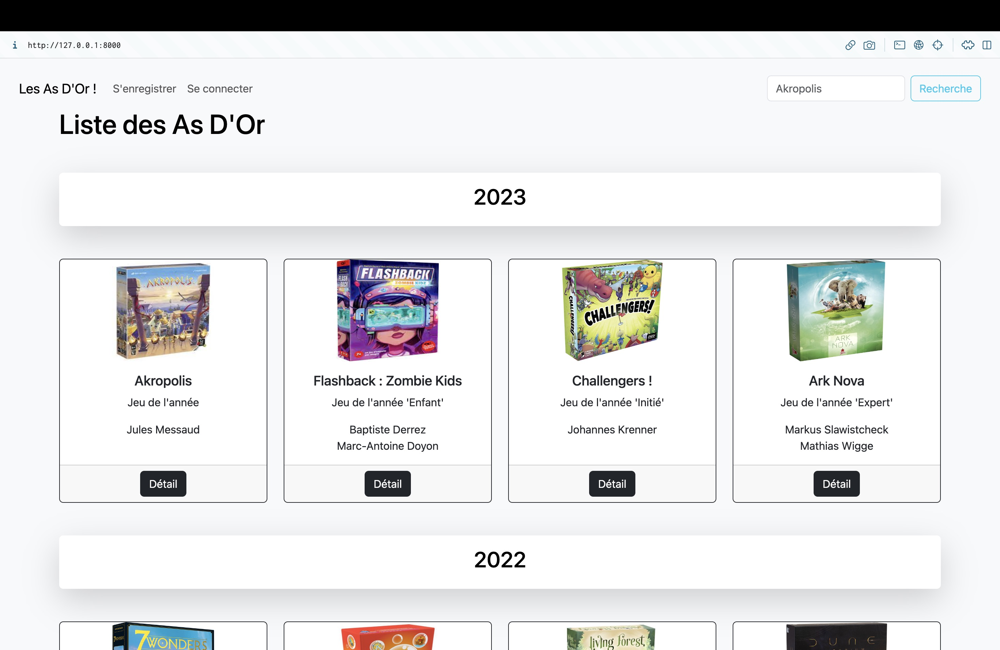

*Vue de l'accueil d'un non identifié.*

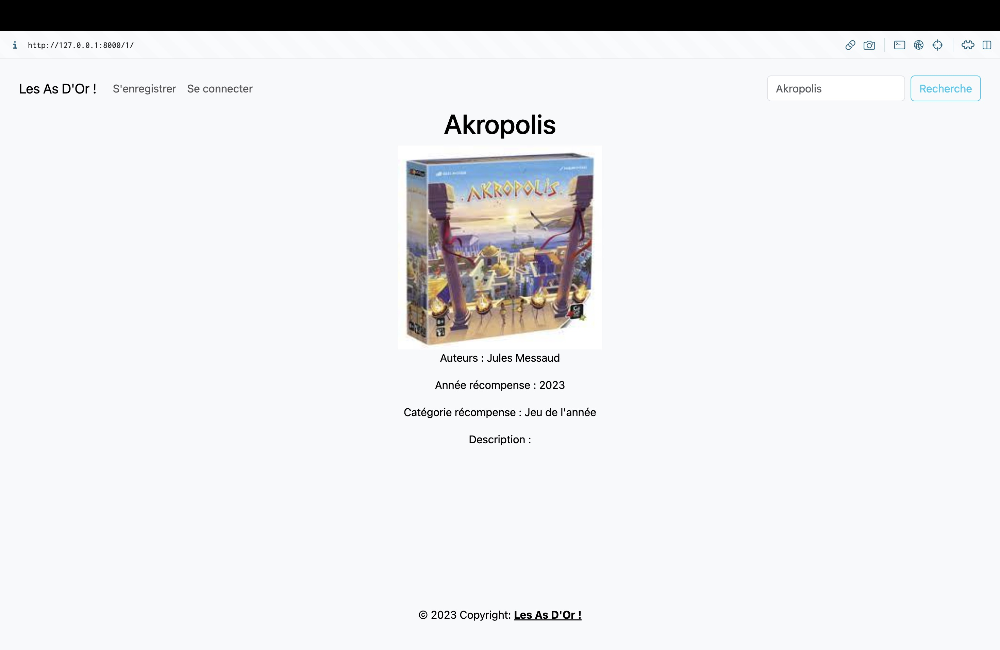

*Vue du détail du jeu en tant que visiteur.*

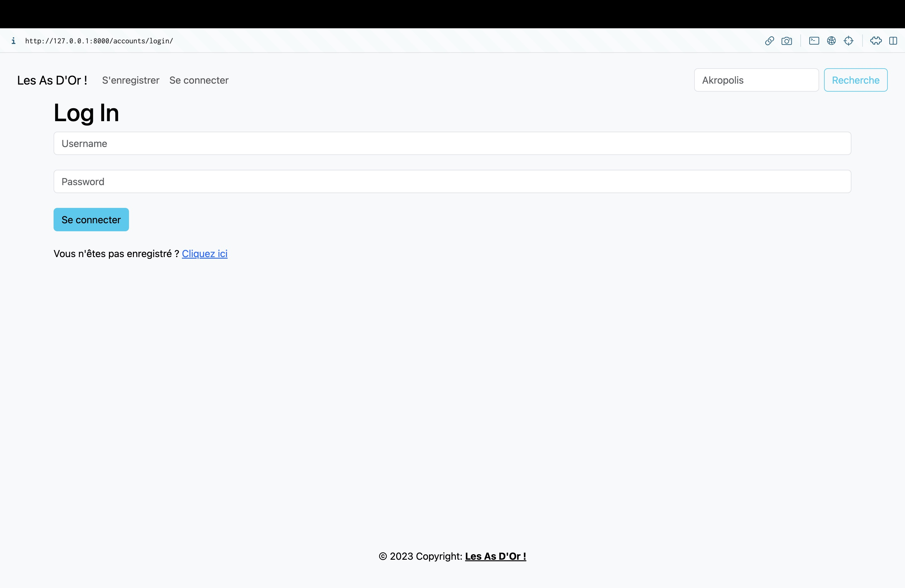

*Vue de la connexion d'un visiteur.*

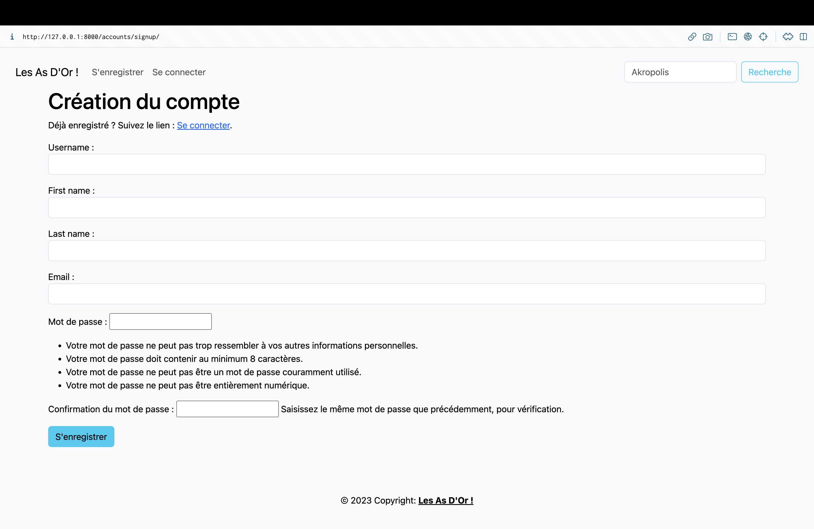

*Vue de l'enregistrement d'un visiteur.*

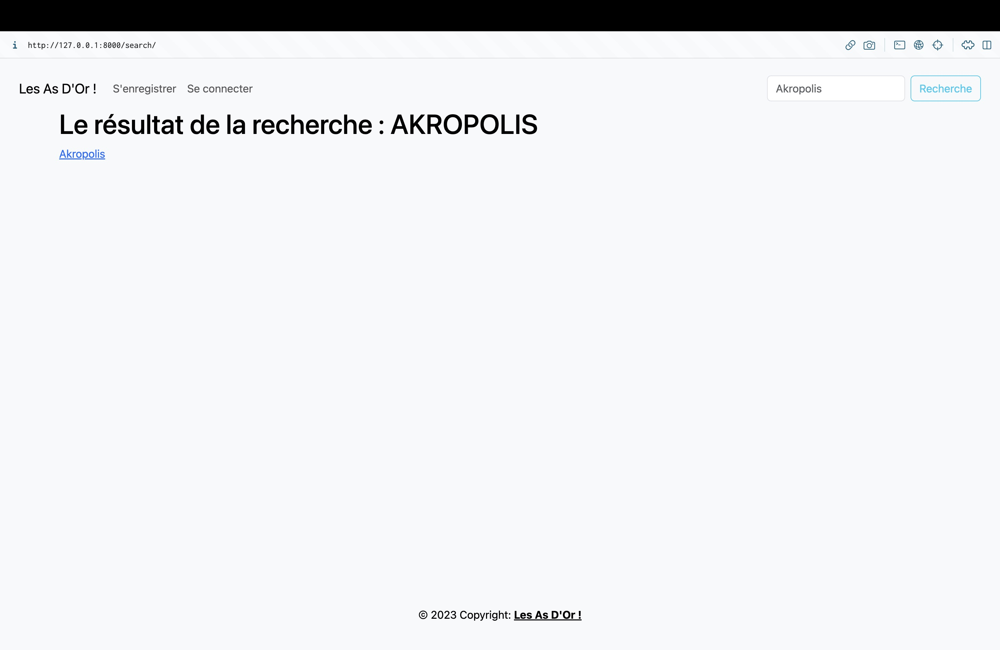

*Vue de la recherche d'un jeu.*

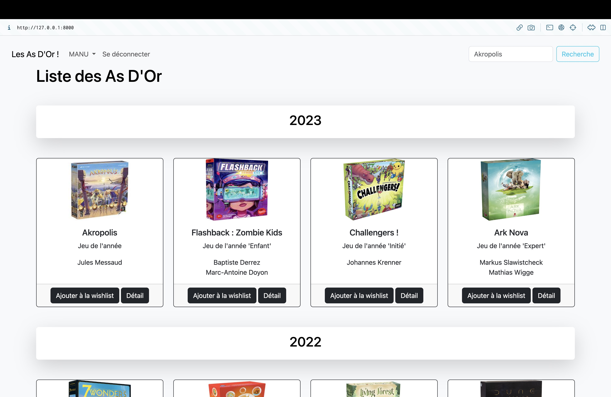

*Vue de l'accueil d'un client.*

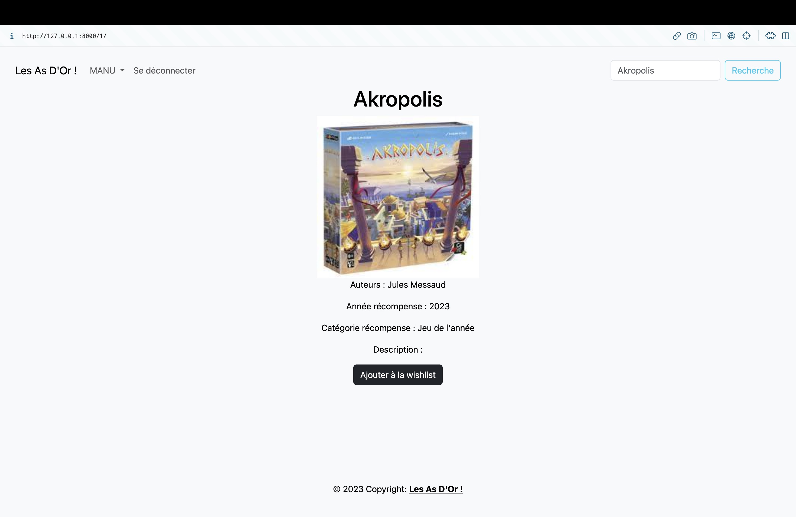

*Vue du détail du jeu en tant que client.*

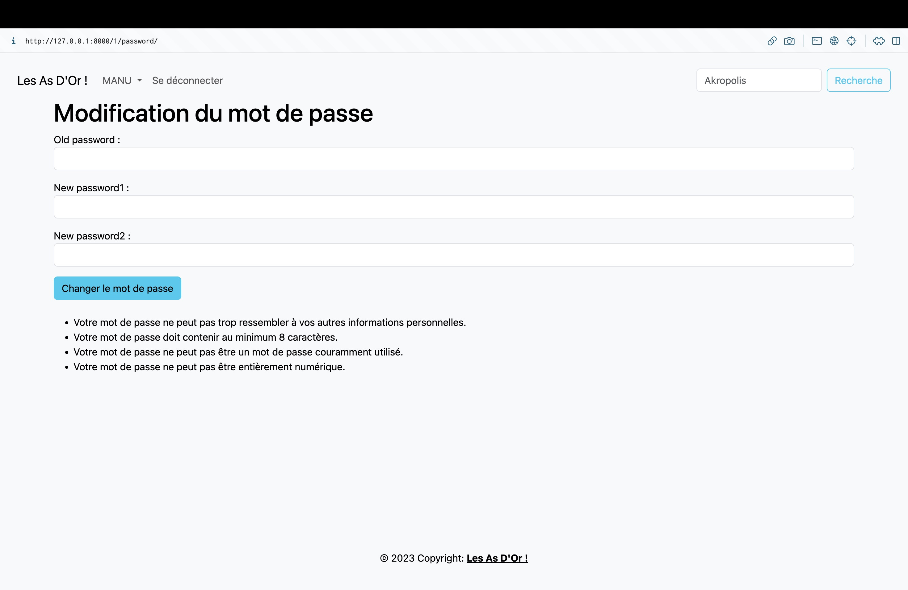

*Vue de la page de changement de mot de passe.*

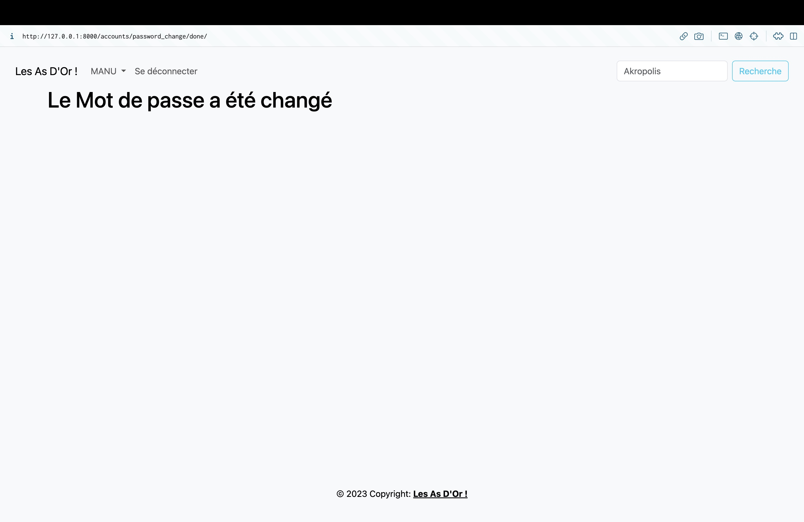

*Vue de la confirmation de changement de mot de passe.*

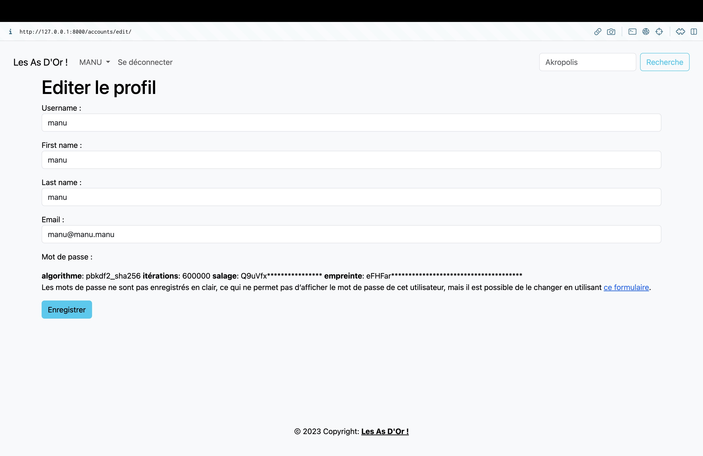

*Vue de la page d'édition du profil client.*

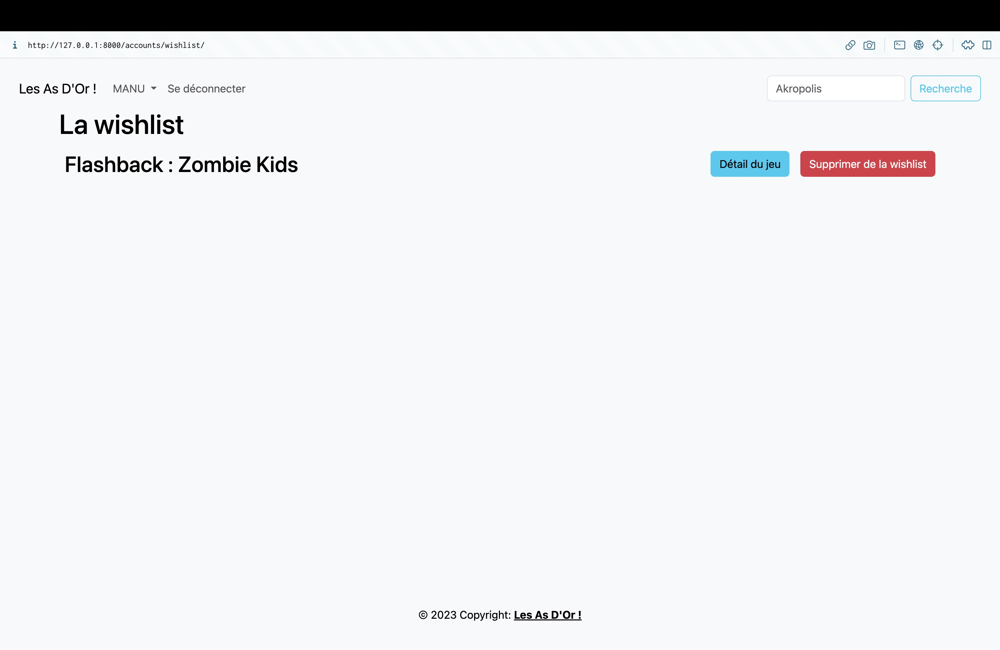

*Vue de la wishlist du client.*
## 6. Gestion de projet 
### a. Méthodologie 
La gestion de projet pour le développement de l'application web "Les As d'Or des jeux de société" a suivi la méthodologie agile. Cette approche a permis une flexibilité et une adaptabilité accrues tout au long du processus de développement.

Des Sprints de 3 semaines ont été plannifiés et ont été en majorité respectés.

### b. Gestion des risques et problèmes rencontrés 
Le principal problème rencontré, fût le manque de temps a cause d'une vie professionnelle chargée.

## 7. Conclusion 
### a. Résumé des résultats obtenus 
Le développement de l'application web "Les As d'Or des jeux de société" a abouti à la création d'une plateforme fonctionnelle et conviviale qui permet aux utilisateurs de découvrir les jeux de société primés, de gérer leur profil utilisateur, de créer des listes de souhaits et de laisser des avis sur les jeux. L'application offre une interface attrayante, des fonctionnalités de recherche avancées et une sécurité robuste pour protéger les données des utilisateurs.

### b. Évaluation du projet par rapport aux objectifs initiaux 
Le projet a atteint avec succès les objectifs initiaux fixés. Les fonctionnalités clés, telles que l'affichage des jeux primés, la création de comptes utilisateurs, la gestion des listes de souhaits et les avis sur les jeux, ont été implémentées avec succès. L'application répond aux besoins des joueurs et des amateurs de jeux de société, leur permettant de trouver facilement des jeux primés, de partager leurs avis et de gérer leur expérience sur la plateforme.

### c. Perspectives d'amélioration et recommandations 
Bien que l'application soit fonctionnelle et satisfasse les besoins de base, il existe encore des possibilités d'amélioration. Voici quelques recommandations pour les améliorations futures :

1. Enrichir la base de données de jeux : Continuer à mettre à jour et à enrichir la base de données des jeux primés, en ajoutant de nouvelles récompenses et en incluant davantage de jeux de société.

2. Améliorer la personnalisation des profils utilisateurs : Offrir aux utilisateurs des options de personnalisation plus avancées pour leurs profils, telles que des avatars, des biographies et des préférences spécifiques.

3. Intégrer des fonctionnalités sociales : Permettre aux utilisateurs de partager leurs listes de souhaits, leurs avis et leurs évaluations sur les réseaux sociaux.

4. Mettre en place des notifications : Implémenter des notifications pour informer les utilisateurs des mises à jour, des nouveaux jeux primés ou des réponses à leurs avis via une newsletter.

5. Ajouter le filtrage : Permettre aux utilisateurs de filtrer le contenu par auteur, par catégorie de prix.

6. Intégrer les modes de paiements : Intégrer un système d'achat via PayPal par exemple.

7. Ajouter des avis/critiques utilisateur : Implémenter la possibilité de donner son avis sur le jeu.

8. Modifier le design avec des fonctionnalités avancées de CSS et JavaScript.

9. Héberger le site (PythonAnywhere, Hostinger, ...)

Ces perspectives d'amélioration permettront d'enrichir davantage l'expérience utilisateur et d'assurer le développement continu de l'application.

En conclusion, le projet de développement de l'application web "Les As d'Or des jeux de société" a été un succès malgré des éléments non aboutis. Le résultat final est une application web qui permet aux utilisateurs de découvrir les jeux de société primés.

## 8. Annexes 
### a. Diagrammes UML 
Les diagrammes UML sont des représentations visuelles utilisées pour modéliser les différentes parties du système. Les diagrammes UML suivants sont inclus dans les annexes :

- Diagramme de cas d'utilisation : Il présente les différentes actions que les utilisateurs peuvent effectuer sur l'application et les relations entre ces actions.

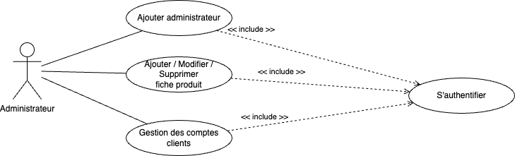

*Afin de pouvoir effectuer ses actions, il est nécessaire de s'authentifier.*

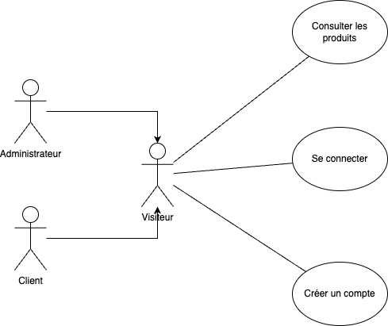

*Un visiteur, qu'il soit client/administrateur mais non connecté, peut voir les produits, se connecter ou créer un compte.*

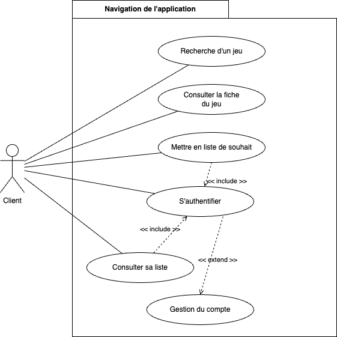

*Un visiteur qui s'est authentifié a droit à plus d'actions qu'un visiteur.*

- Diagramme de classes <a id="model-classe"> : Il montre les différentes classes et leurs relations dans le système, y compris les entités principales et les fonctionnalités clés.

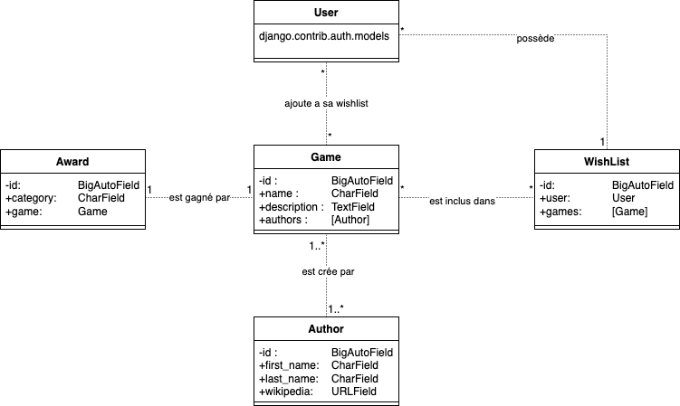

*Un Game est crée par un ou plusieurs Author. Un Award est gagné par un seul Game. Un User a une seule Wishlist. Un User peut ajouter plusieurs Game a sa Wishlist. Une Wishlist inclus 0 ou plusieurs Game.*

- Diagramme de séquence : Il illustre la séquence des interactions entre les utilisateurs et le système pour différentes fonctionnalités.

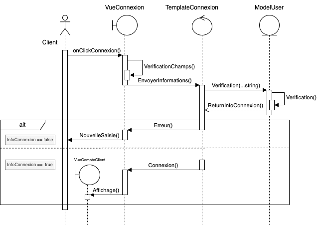

*Diagramme de séquence du module connexion.*

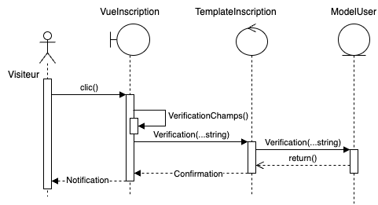

*Diagramme de séquence du module inscription.*

### b. Sources d'information utilisées 
Cette section répertorie les sources d'information qui ont été utilisées lors du développement de l'application web :
- https://www.djangoproject.com/
- https://stackoverflow.com/
- https://getbootstrap.com/
- https://openclassrooms.com/
- https://youtube.com/
